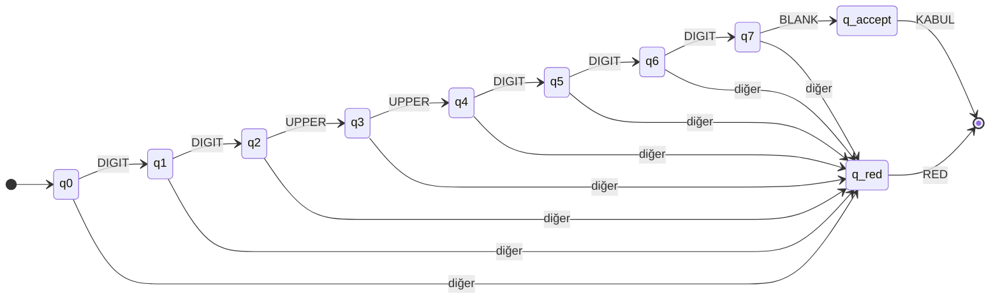

https://github.com/the-duru/turing-makinesi-binary-carpma2
# Turing Makinesi ile Araç Plaka Formatı Tanıyıcı — Proje Raporu
## 1. Problem tanımı

Araç plakalarının belirli bir biçimde olup olmadığını kontrol eden sistemler, girdiyi karakter karakter okuyarak format kurallarına uygunluğu doğrular. Bu projede aynı mantık, **Turing Makinesi (TM)** modeli ile Python’da simüle edilmiştir.

Program, kullanıcıdan alınan plaka dizisini bant üzerine yerleştirir; makine soldan sağa ilerleyerek her adımda durum, okunan sembol, kafa hareketi ve bant içeriğini gösterir. Sonuç **KABUL** veya **RED** olarak üretilir.

## 2. Tanınan dilin açıklaması

**Format:** `NNLLNNN`

| Konum | 1–2 | 3–4 | 5–7 |
|-------|-----|-----|-----|
| Tür | Rakam (N) | Büyük harf (L) | Rakam (N) |
| Alfabe | 0–9 | A–Z | 0–9 |

- Toplam uzunluk: **tam 7 karakter**
- Küçük harf, özel karakter veya fazla/eksik uzunluk **kabul edilmez**

**Örnekler**

| Girdi | Sonuç |
|-------|--------|
| 55AB123 | KABUL |
| 34TR456 | KABUL |
| 5AB123 | RED (eksik) |
| 55ab123 | RED (küçük harf) |
| 34AB12X | RED (geçersiz sembol) |

## 3. Turing Makinesi modeli

| Bileşen | Tanım |
|---------|--------|
| Durum kümesi Q | {q0, q1, …, q7, q_accept, q_red} |
| Giriş alfabeti Σ | {0,…,9, A,…,Z} |
| Bant alfabesi Γ | Σ ∪ {_} |
| Başlangıç durumu | q0 |
| Kabul durumu | q_accept |
| Red durumu | q_red |
| Geçiş fonksiyonu δ | `GECIS_TABLOSU.md` |
| Bant | `_` + girdi + `_` |
| Kafa | Başlangıçta ilk giriş karakterinde |

Doğrulama **if-else ile format kontrolü yapılmadan**, yalnızca δ tablosundaki durum geçişleri ile gerçekleştirilir.

## 4. Durumların açıklaması

| Durum | Anlam |
|-------|--------|
| q0 | İlk rakam bekleniyor |
| q1 | İkinci rakam bekleniyor |
| q2 | İlk büyük harf bekleniyor |
| q3 | İkinci büyük harf bekleniyor |
| q4 | Beşinci karakter (1. son rakam) bekleniyor |
| q5 | Altıncı karakter (2. son rakam) bekleniyor |
| q6 | Yedinci karakter (3. son rakam) bekleniyor |
| q7 | Bant sonu (boşluk) bekleniyor — fazla karakter yoksa kabul |
| q_accept | Kabul — çıktı: KABUL |
| q_red | Red — çıktı: RED |

## 5. Geçiş mantığının açıklaması

Makine her adımda kafanın altındaki sembolü okur, sembolü sınıflandırır (rakam / büyük harf / boş / diğer) ve δ’ye göre yeni duruma geçer. Beklenen sınıf gelmezse doğrudan **q_red**’e gidilir.

**Örnek — geçerli:** `55AB123`

```
q0 → 5 → q1 → 5 → q2 → A → q3 → B → q4 → 1 → q5 → 2 → q6 → 3 → q7 → □ → q_accept → KABUL
```

**Örnek — geçersiz:** `55A1234`

```
q0 → 5 → q1 → 5 → q2 → A → q3 → 1 (rakam) → q_red → RED
```

## 6. Durum geçiş diyagramı



## 7. Test girdileri

### Geçerli (5 adet)

| # | Girdi | Beklenen |
|---|--------|----------|
| 1 | 55AB123 | KABUL |
| 2 | 34TR456 | KABUL |
| 3 | 06AA789 | KABUL |
| 4 | 00ZZ000 | KABUL |
| 5 | 99XY999 | KABUL |

### Geçersiz (5 adet)

| # | Girdi | Beklenen | Neden |
|---|--------|----------|--------|
| 1 | 5AB123 | RED | Eksik karakter |
| 2 | 555AB12 | RED | Yanlış konumda rakam |
| 3 | 34A1234 | RED | Eksik harf |
| 4 | AB34123 | RED | Rakamla başlamıyor |
| 5 | 55ab123 | RED | Küçük harf |

Test paketi: programda `t` yazarak veya `python -c "from turing_plaka import run_test_suite; run_test_suite()"` ile çalıştırılır.

## 8. Program kullanımı

```bash
python turing_plaka.py
```

- Plaka girin → adım adım simülasyon ve **KABUL** / **RED**
- `t` → otomatik test paketi
- Boş Enter → çıkış

**Ekran görüntüsü:** `python turing_plaka.py` çalıştırıp örnek `55AB123` ve `55A1234` girdilerinin çıktısını rapora ekleyin.

## 9. Sonuç ve değerlendirme

Turing Makinesi modeli, plaka formatı gibi sabit uzunluklu ve konum bazlı kurallar için uygundur. Durumlar (`q0`–`q7`) doğrudan “hangi konumda hangi sembol türü bekleniyor” sorusunu kodlar; tüm red koşulları tek bir **q_red** durumunda birleşir.

Simülatör, bant yapısı, okuma kafası, geçiş tablosu ve adım adım izlenebilir çıktı ile ödev gereksinimlerini karşılar. Gelecekte format değişirse (ör. `NNLLLNN`) yalnızca durum sayısı ve δ tablosu güncellenerek aynı çerçeve kullanılabilir.

## 10. Dosya listesi

| Dosya | Açıklama |
|-------|----------|
| `turing_plaka.py` | TM simülatörü ve ana program |
| `GECIS_TABLOSU.md` | Formal geçiş tablosu |
| `RAPOR.md` | Bu rapor |
| `README.md` | Hızlı başlangıç |
